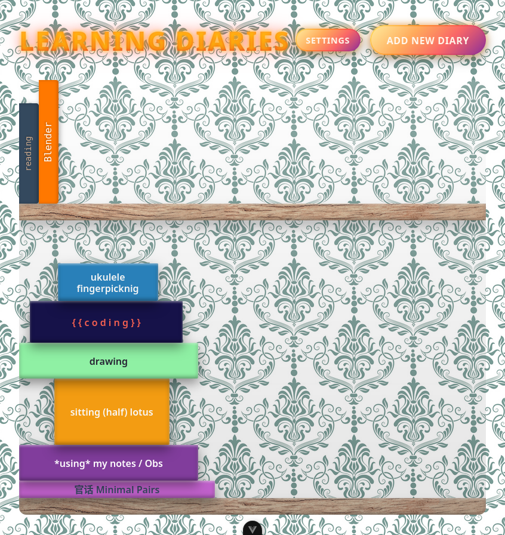

# Learning Diaries

## Features

### Core Functionality

- **Multiple Diaries**: Create unlimited learning diaries, each with customizable appearance
- **Rich Entries**: Add journal entries with text and images, organized chronologically
- **Customizable Design**: Personalize each diary with custom colors, fonts, sizes, and styles
- **Bookshelf View**: Visual representation of all your diaries as books on a shelf
- **Notebook Interface**: Read entries as pages in a realistic notebook with date headers and navigation

### Data Management

- **Offline-First**: All data stored locally using IndexedDB (Dexie.js)
- **Google Drive Backup**: Optional cloud backup integration
  - Manual backup and restore
  - Automatic daily backups (optional)
  - Google OAuth authentication
- **Local Backup**: Export/import data as JSON files
- **Data Statistics**: View counts of diaries, entries, and database size

### Entry Features

- **Block-Based Content**: Entries support multiple content blocks
  - Text blocks with multi-line support
  - Image blocks with optional captions (base64 encoded)
- **Date Organization**: One entry per day per diary, with automatic merging of same-day entries
- **Navigation**: First/Previous/Next/Last page controls
- **URL-Based Pagination**: Shareable links to specific entries via `?page=N` query parameter
- **Default to Latest**: Opens to the most recent entry by default

## Technology Stack

- **Frontend Framework**: Vue 3 with Composition API
- **Language**: TypeScript
- **Build Tool**: Vite
- **Routing**: Vue Router 4
- **Database**: Dexie.js (IndexedDB wrapper)
- **Testing**: Vitest + Vue Test Utils
- **Code Quality**: ESLint + Prettier

## Project Structure

```
src/
├── components/
│   ├── BookSpine.vue       # Individual diary visualization
│   └── EntryModal.vue      # Modal for adding new entries
├── composables/
│   ├── useDiaries.ts       # Diary CRUD operations
│   └── useEntries.ts       # Entry CRUD operations
├── services/
│   ├── googleAuth.ts       # Google OAuth integration
│   ├── googleDrive.ts      # Google Drive API integration
│   └── backup.ts           # Backup/restore logic
├── views/
│   ├── BookshelfView.vue   # Home page with all diaries
│   ├── DiaryView.vue       # Individual diary with pagination
│   ├── NewDiaryView.vue    # Create new diary form
│   └── SettingsView.vue    # Settings and backup management
├── router/
│   └── index.ts            # Vue Router configuration
└── App.vue                 # Root component
```

## Requirements

- Node.js: `^20.19.0 || >=22.12.0`

## Getting Started

### Installation

```sh
npm install
```

### Development

```sh
npm run dev
```

### Build for Production

```sh
npm run build
```

### Preview Production Build

```sh
npm run preview
```

### Run Tests

```sh
npm run test:unit
```

### Lint and Format

```sh
npm run lint
npm run format
```

## Database Schema

### Diaries Table

- `id`: Auto-increment primary key
- `title`: String
- `width`: Number (pixels)
- `height`: Number (pixels)
- `color`: String (hex color)
- `fontColor`: String (hex color)
- `fontFamily`: String
- `fontSize`: Number
- `bold`: Boolean
- `italic`: Boolean
- `createdAt`: Date

### Entries Table

- `id`: Auto-increment primary key
- `diaryId`: Number (foreign key)
- `date`: String (YYYY-MM-DD format)
- `blocks`: Array of EntryBlock objects
  - `type`: 'text' | 'image'
  - `content`: String (text content or base64 image data)
  - `caption`: String (optional, for images)

## Usage

1. **Create a Diary**: Click "Add New Diary" from the bookshelf
2. **Customize**: Set title, dimensions, colors, and typography
3. **Add Entries**: Open a diary and click "Add Entry"
4. **Add Content**: Write text or upload images with optional captions
5. **Navigate**: Use First/Previous/Next/Last buttons to browse entries
6. **Share**: Copy the URL to share a link to a specific entry
7. **Backup**: Configure Google Drive backup in Settings (optional)

## Data Migration

The app includes automatic schema migration from v1 (string-based content) to v2 (block-based content). Legacy entries are automatically converted to the new format on first load.

## Browser Support

Works in all modern browsers that support:

- IndexedDB
- ES6+ JavaScript
- CSS Grid and Flexbox

## License

Private project
